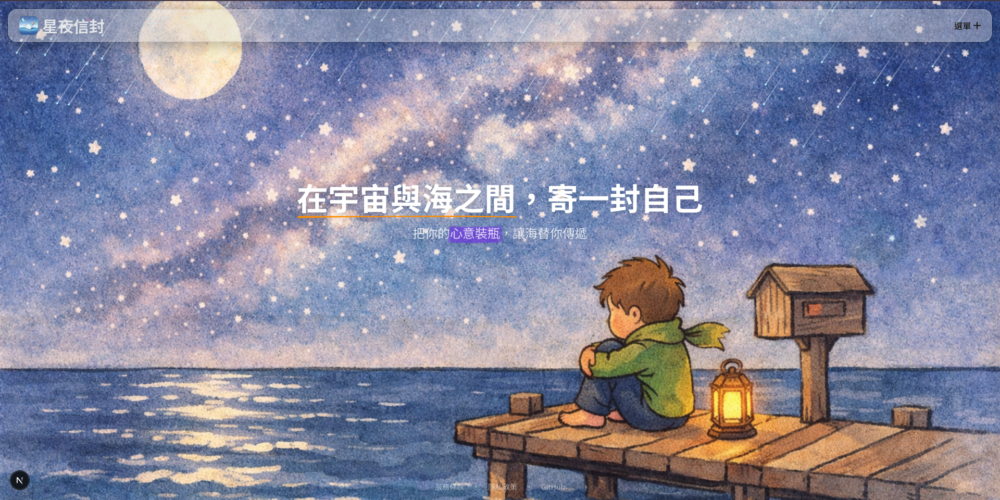

# 星夜信封 Starry Envelope



一個數位漂流瓶網站，讓用戶可以匿名發送和接收訊息。在星空下的碼頭，等待來自遠方的信。

## 功能特色

- **多種瓶子類型** - 普通瓶、同縣市瓶、提問瓶、祝願瓶、發洩瓶、真話瓶、暗號瓶、傳遞瓶
- **匿名互動** - 無需註冊，自動建立匿名帳號
- **每日撈瓶** - 每天 6 次撈瓶機會
- **回覆系統** - 撈到瓶子可以回覆，支援未讀通知
- **傳遞瓶** - 多人接力傳遞，可見完整對話鏈
- **暗號瓶** - 設定暗號，只有知道暗號的人才能撈到

## 技術棧

- **框架**：Next.js 16 (App Router)
- **樣式**：Tailwind CSS v4 + shadcn/ui
- **動畫**：GSAP + Framer Motion
- **資料庫**：Supabase (PostgreSQL + Auth)
- **部署**：Vercel

## 本地開發

### 環境需求

- Node.js 18+
- pnpm

### 安裝步驟

```bash
# 複製專案
git clone https://github.com/dianyike/starry-envelope.git
cd starry-envelope

# 安裝依賴
pnpm install

# 設定環境變數
cp .env.example .env.local
# 編輯 .env.local 填入 Supabase 憑證

# 啟動開發伺服器
pnpm dev
```

### 環境變數

```bash
NEXT_PUBLIC_SUPABASE_URL=your_supabase_url
NEXT_PUBLIC_SUPABASE_ANON_KEY=your_supabase_anon_key
```

## 授權

本專案採用 [MIT 授權](./LICENSE)。

## 相關文件

- [服務條款](./TERMS.md)
- [隱私政策](./PRIVACY.md)
- [更新日誌](./CHANGELOG.md)
